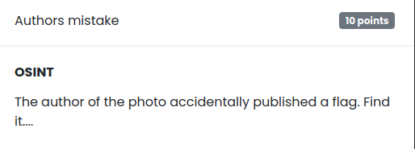

# Find location

## Challenge

## Solution

The challenge gives us a link which points to a Pinterest's picture:

Link: [https://www.pinterest.fr/pin/964051863962640190/](https://www.pinterest.fr/pin/964051863962640190/)

Clicking on the author of the post takes you to her/his profile, where you can see more photos.

After looking at each photo, you can see that the last one has the flag as a comment:

The flag: `VU{179d9afbd6a5a817ca2765ab958ba9d8ec95eb7c}`
