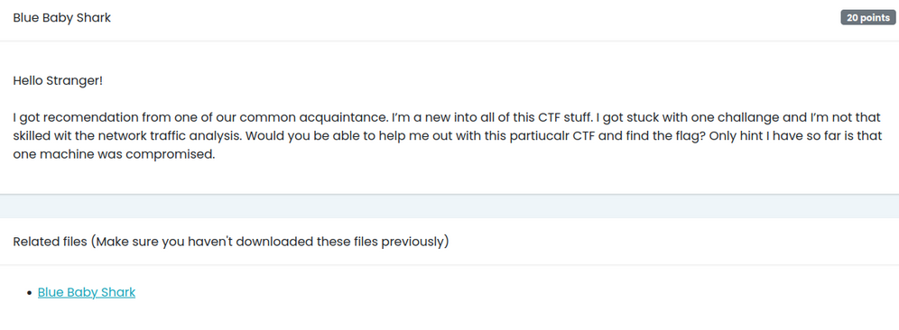
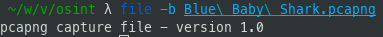
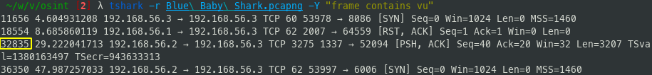
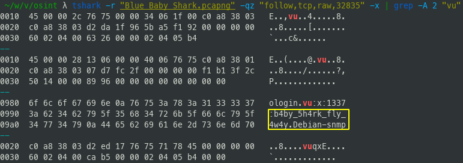

# Blue Baby Shark

## Challenge

## Solution

We have been given a `.pcapng` file in which we will have to find the flag:

We will use `tshark` to parse the file and filter on packets that might contain the string `vu`:

We get 4 packets that contain the string `vu`. `Len=X` is an indicator of the size in bytes of the data in the frame. As only the `32835` packet appears to have content, we will analyse it:

Bingo! The flag is: `VU{b4by_5h4rk_fly_4w4y}`
