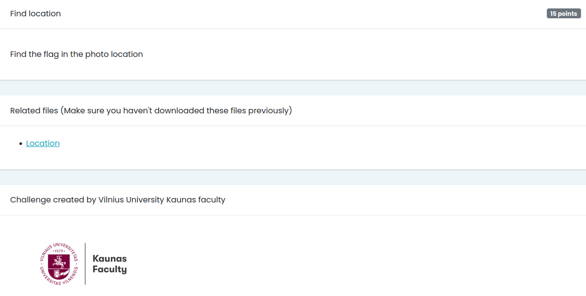
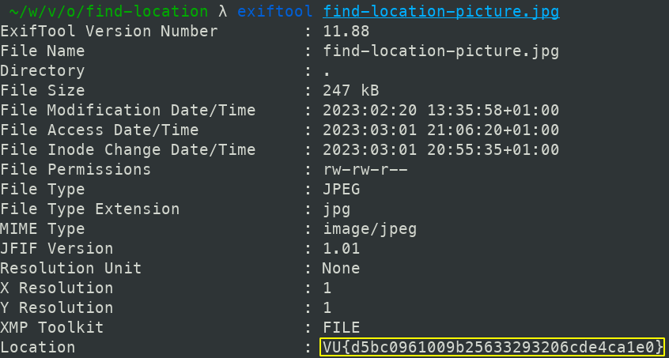

# Find location

## Challenge

## Solution

The challenge gives us an image file to download:

By running `exiftool` on the image, we can retrieve the metadata:

The flag is easily visible: `VU{d5bc0961009b25633293206cde4ca1e0}`
