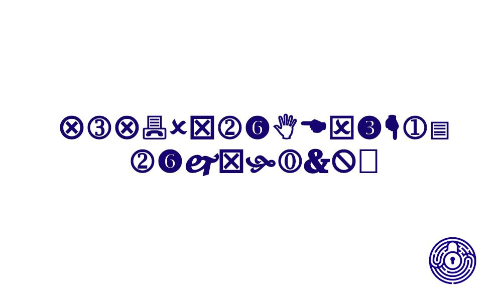

# Plain sight

## Challenge

The challenge tells us that we have to find the dean of Vilnius University, as he has hidden the flag in plain sight. Once you find him, you get the flag.

## Solution

This challenge was particularly difficult because of the very evasive text. It was enough to google the name of the dean of the university `Assoc. Prof. Dr. Kęstutis Driaunys`, and find his personal Facebook page ([https://www.facebook.com/kes.dri](https://www.facebook.com/kes.dri)), on which there was an image with symbols and the CTF logo indicating that this was the right way:

The symbols font is recognized as `Wingdings 2`. You can then use an online tool to decode it or do it by hand with grids available on Google Images.

The flag once decoded: `VU{993440293a8be}`
