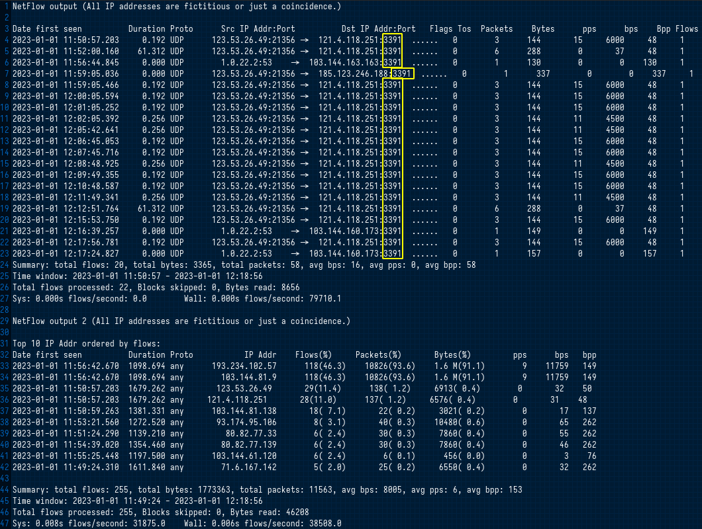
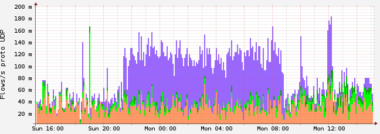
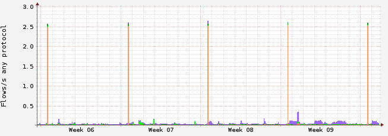

# Task Netattack

## Challenge

By analyzing the NetFlow information (the information is presented in the impact and in the text file), you must identify what vulnerability was used to carry out this attack. This is one of the most famous Windows attacks. The correct answer is the CVE code (answer must be `CVE-XXXX-XXXX`)

## Solution

The challenge asked us to analyse 3 files: a `NetFlow` output and two images with traffic graphs. According to these 3 files, it is possible to detect a network attack, apparently "one of the most famous Windows attacks".

Let's take a closer look at the text file, which contains the output of `NetFlow`. `NetFlow` is a protocol used to monitor network traffic, the output gives information about the source and destination of IP addresses, protocol, duration, flags, packets, bytes and other traffic characteristics.

From this particular output, we can see that the traffic is primarily `UDP` traffic between the IP address 123.53.26.49 and 121.4.118.251. The traffic appears to be going to port `3391` on the destination IP address. There is also one packet going to port 53 on the IP address 103.144.163.163 and one packet going to port `3391` on the IP address 185.123.246.188.



And here are the other two images provided:





After a Google search with the terms: `"attack windows UDP port 3391 CVE code"` one easily finds the following CVE code: `CVE-2020-0610`.

```
A remote code execution vulnerability exists in Windows Remote Desktop Gateway (RD Gateway) when an unauthenticated attacker connects to the target system using RDP and sends specially crafted requests, aka 'Windows Remote Desktop Gateway (RD Gateway) Remote Code Execution Vulnerability'. This CVE ID is unique from CVE-2020-0609. 

(https://cve.mitre.org/cgi-bin/cvename.cgi?name=CVE-2020-0610)
```

Therefore, the flag is: `VU{CVE-2020-0610}`
